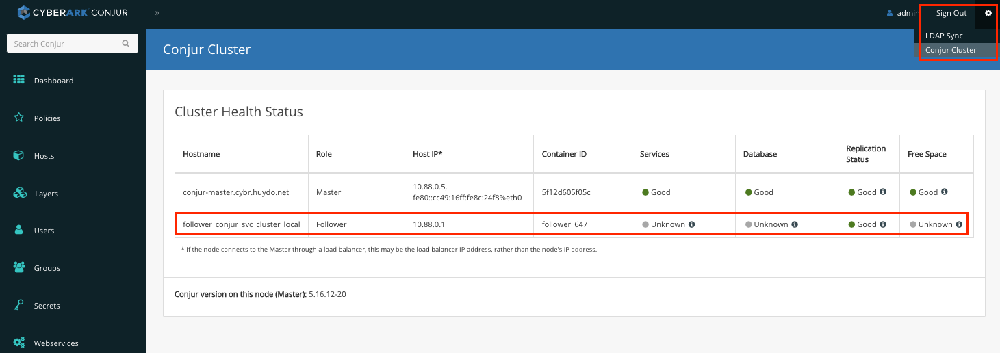

# Building standalone CyberArk Conjur Enterprise and K8s LAB
This project will help you to quickly build up the standalone, single VM lab environment to test conjur and k8s application integration including:
- conjur follower in kubernetes 
- k8s jwt authentication
- conjur push to k8s file
- conjur push to kubernetes secret
- and other

All setup, installing and configuration steps are all put in sequence of scripts to make the setup process quicker and easier

Comments and question, please send to <huy.do@cyberark.com>

Thanks and kudos to @Joe Tan (joe.tan@cyberark.com) for the detail of installing and configuration guide at https://github.com/joetanx

### Video on step by step setting up this LAB is at https://youtu.be/qiXBtv5R1z4

# PART I: SETING UP ENVIRONMENT
# 1.1. LAB Prerequisites
- ESXI server or VMWorkstation to create standalone lab VM as below:
  - 12GB RAM (minimum), recommended 16GB
  - 2 vCore CPU
  - 60GB HDD
  - CentOS Stream 9 base OS (Minimal Install)
    - Hostname: k8s.demo.local
    - LAN IP (eg 172.16.100.109/24)
    - Internet connection to do yum updating and packages installation
- Conjur appliance images & utilities:
  - Contact CyberArk local representative for following images and tools
    - conjur-appliance-Rls-12.7.tar.gz
    - conjur-cli-rhel-8.tzr.gz
  - CyberArk softwares and related tools can be downloaded at https://cyberark-customers.force.com/mplace/s/#software

 *The IP addresses in this document are using from current lab environment. Please replace the **172.16.100.109** by your actual **VM IP**’s
    
# 1.2. VMs Preparation
## **Step1.2.1: Preparing CentOS Stream 9**
CentOS Stream 9 can be downloaded at https://www.centos.org/download/


Creating VM and installing with minimal install option


- Checking for IP, DNS and Internet connection
- Installing git tool
```
yum -y install git
```
## **Step1.2.2: Copying files for setting up**
Login to VM as root, creating folder for setup_files
```
mkdir -p /opt/lab/setup_files
chmod 777 /opt/lab/setup_files
```
Copy conjur appliance image file to setup_files folder
- Conjur docker image: conjur-appliance-Rls-12.7.tar.gz
## **Step1.2.3: Cloning git hub repo**
Login to VM as root and running below command
```
cd /opt/lab
git clone https://github.com/huydd79/conjur-k8s-lab
```
Installation folder contains 3 sub folders for diffirent setup
- 1.k8s-setup: scripts to setup k8s standalone cluster environment
- 2.conjur-setp: scripts to install podman, mysql, conjur master containers and deploying conjur follower in k8s
- 3.cityapp-setup: scripts to deploys different types of cityapp application

Each folder will have ```00.config.sh``` which contains some parameters. Review file content, change all related parameters to actual value and set ```READY=true``` before doing further steps.

# PART II: SETING UP CONJUR - K8S LAB
# 2.1. Setting up K8s standalone cluster
## **Step2.1.1: Installing cri-o**
Login to VM as root, running below command to install cri-o
```
cd /opt/lab/conjur-k8s-lab/1.k8s-setup
./01.installing-cri-o.sh
```
Checking crio service after done to make sure crio is up and run
```
service crio status
```
## **Step2.1.2: Installing kubelet kubeadm and kubectl**
Login to VM as root, running below command to install kubelet and tools
```
cd /opt/lab/conjur-k8s-lab/1.k8s-setup
./02.installing-k8s-and-tools.sh
```
## **Step2.1.3: Setting up cluster and networking**
Login to VM as root, running below command to create stand alone cluster and configure networking
```
cd /opt/lab/conjur-k8s-lab/1.k8s-setup
./03.creating-k8s-cluster.sh 
```
Make sure that cni0 interface is getting correct IP (in 10.244) before doing futher steps
```
ip address show dev cni0 | grep 10.244
```
Checking for the kubelet service status and cluster info
```
service kubelet status
kubectl get all
```
## **Step2.1.4: Setting up kubernetes dashboard**
Login to VM as root, running below command to install kubernetes dashboard web GUI
```
cd /opt/lab/conjur-k8s-lab/1.k8s-setup
./04.installing-k8s-dashboard.sh
```
Copy the value of service account token to notepad for later usage. Checking status of k8s dashboard deployment
```
kubectl -n kubernetes-dashboard get pods -o wide
```
Open browser and login to k8s dashboard using previous copied token
```
https://<VMIP>:30443
```


Select kube-system namespace and review some of the data in dashboard


# 2.2. Setting up podman and conjur environment
## **Step2.2.1: Reviewing 00.config.sh**
Login to VM as root, edit the 00.config.sh
```
cd /opt/lab/conjur-k8s-lab/2.conjur-setup
vi 00.config.sh
```
Changed all related parameters such as IP, domain, password... and set ```READY=true``` to continue
## **Step2.2.2: Installing podman**
Login to VM as root and running below commands
```
cd /opt/lab/conjur-k8s-lab/2.conjur-setup
./01.installing-podman.sh
```
Using ```podman image ls``` to check current podman images
## **Step2.2.3: Setting up mysql container and database**
Login to VM as root and running below commands
```
cd /opt/lab/conjur-k8s-lab/2.conjur-setup
./02.running-mysql-db.sh
```
Using command ```podman container ls``` to make sure mysql container is up and running.
Using command ```ping mysql.demo.local``` to make sure host entry has been added correctly
## **Step2.2.4: Installing conjur master**
Login to VM as root and running below commands
```
cd /opt/lab/conjur-k8s-lab/2.conjur-setup
./03.loading-conjur-images.sh
./04.starting-conjur-container.sh
./05.configuring-conjur-master.sh
```
Using command ```podman image ls | grep conjur``` to make sure that image is loaded correctly

Using command ```podman container ls``` to make sure that conjur1 container is up and running

Using command ```curl -k https://conjur-master.demo.local/info``` to check conjur master status

Using browser and put in conjur master URL ```https://<VMIP>```, login using user admin and password was set in ```00.config.sh``` file
```
https://<VM-IP>/
```


## **Step2.2.5: Installing conjur CLI**
Login to VM as root and running below commands
```
cd /opt/lab/conjur-k8s-lab/2.conjur-setup
./06.installing-conjur-cli.sh
```

Enter ```yes``` for ```Trust this certificate``` question and providing admin password for conjur cli configuration. 

Using command ```conjur whoami``` to doublecheck the result.

## **Step2.2.6: Loading demo data and enable conjur-k8s-jwt authentication**
Login to VM as root and running below commands
```
cd /opt/lab/conjur-k8s-lab/2.conjur-setup
./07.loading-demo-data.sh
./08.enable-k8s-jwt-authenticator.sh
./09.loading-conjur-jwt-data.sh 
```
Using ```curl -k https://conjur-master.demo.local/info``` to see the authenticaion options that are enabled.
```
...
  "authenticators": {
    "installed": [
      "authn",
      "authn-azure",
      "authn-gcp",
      "authn-iam",
      "authn-jwt",
      "authn-k8s",
      "authn-ldap",
      "authn-oidc"
    ],
    "configured": [
      "authn",
      "authn-jwt/k8s"
    ],
    "enabled": [
      "authn",
      "authn-jwt/k8s"
...    
```

Using browser, login to conjur GUI to review the demo data and content. Make sure all authn-jwt/k8s secrets got values
- conjur/authn-jwt/k8s/audience: jwt audience, should be ```cybrdemo``` by default.
- conjur/authn-jwt/k8s/identity-path: jwt path for identity, should be ```jwt-apps/k8s``` by default.
- conjur/authn-jwt/k8s/issuer: jwt issuer, should be ```https://kubernetes.default.svc.cluster.local``` by default
- conjur/authn-jwt/k8s/public-keys: k8s public key information, should be in json format.


If any of above parameters is emply, please run script ```./09.loading-conjur-jwt-data.sh``` again.

## **Step2.2.7: Deploying conjur follower on k8s**
Login to VM as root and running below commands
```
cd /opt/lab/conjur-k8s-lab/2.conjur-setup
./10.loading-k8s-follower-configmap.sh 
./11.deploying-follower-k8s.sh 
```
Login to k8s dashboard, select namespace conjur and checking for follower deployment and pod status


Login to conjur GUI, go to ```seting>Conjur Cluster``` to check for follower status


Using command ```curl -k https://<VM-IP>:30444/info``` to check for follower detai info
```
...
  "authenticators": {
    "installed": [
      "authn",
      "authn-azure",
      "authn-gcp",
      "authn-iam",
      "authn-jwt",
      "authn-k8s",
      "authn-ldap",
      "authn-oidc"
    ],
    "configured": [
      "authn",
      "authn-jwt/k8s"
    ],
    "enabled": [
      "authn-jwt/k8s"
    ]
...
```

# PART III: TESTING CITYAPP OPTIONS
# 3.1. Building cityapp image
## **Step3.1.1: Reviewing 00.config.sh**
Login to VM as root, edit the 00.config.sh
```
cd /opt/lab/conjur-k8s-lab/3.cityapp-setup
vi 00.config.sh
```
Changed all related parameters such as IP, domain... and set ```READY=true``` to continue
## **Step3.1.2: Building image**
Login to VM as root, review the cityapp image detail on /opt/lab/conjur-k8s-lab/3.cityapp-setup/build
- Dockerfile: contain building info
- index.php: detail code of cityapp web application
Running below command to build cityapp image
```
cd /opt/lab/conjur-k8s-lab/3.cityapp-setup
./01.building-cityapp-image.sh
```
Using command ```podman image ls | grep cityapp``` to make sure cityapp image has been build and put at localhost/cityapp

# 3.2. Running cityapp-hardcode
Login to VM as root, running below command to deploy cityapp-hardcode
```
cd /opt/lab/conjur-k8s-lab/3.cityapp-setup
./02.running-cityapp-hardcode.sh
```
Using browser and access to ```http://<VM-IP>:30080``` to open cityapp-hardcode webapp for the result


Using k8s dashboard GUI and select cityapp namespace to see more detail on cityapp-hardcode pod. This application is being run with database credentials from environment parameters.


# 3.3. Running cityapp-conjurtok8sfile
Application cityapp-conjurtok8sfile is configured with sidecar container (secrets-provider-for-k8s) which is run in the same pod with cityapp. The sidecar will connect to conjur follower pod, using jwt authentication method and check for database credentials. Information will then be written into ```/conjur/secret``` folder and linked to cityapp's ```/conjur``` folder using shared volume. The architecture of this method is described at below CyberArk document link.

[CyberArk Secret Provider: Push to File mode](https://docs.cyberark.com/Product-Doc/OnlineHelp/AAM-DAP/Latest/en/Content/Integrations/k8s-ocp/cjr-k8s-secrets-provider-ic-p2f.htm?TocPath=Integrations%7COpenShift%2FKubernetes%7CSet%20up%20applications%7CSecrets%20Provider%20for%20Kubernetes%7CInit%20container%7C_____2 "Push to file")


To deploy conjurtok8sfile application, login to VM as root, running below command
```
cd /opt/lab/conjur-k8s-lab/3.cityapp-setup
./03.running-cityapp-conjurtok8sfile.sh
```

Going to k8s dashboard GUI, select cityapp namespace and open cityapp-conjurtok8sfile 's sidecar container log, the detail of authentication result will be shown as below
```
INFO:  2022/11/20 17:29:18.217628 main.go:62: CSPFK008I CyberArk Secrets Provider for Kubernetes v1.4.4-5f8218a starting up
INFO:  2022/11/20 17:29:18.219453 main.go:226: CSPFK014I Authenticator setting DEBUG provided by environment
INFO:  2022/11/20 17:29:18.219480 configuration_factory.go:82: CAKC070 Chosen "authn-jwt" configuration
INFO:  2022/11/20 17:29:18.219521 main.go:217: CSPFK014I Authenticator setting CONTAINER_MODE provided by annotation conjur.org/container-mode
INFO:  2022/11/20 17:29:18.219529 main.go:226: CSPFK014I Authenticator setting DEBUG provided by environment
INFO:  2022/11/20 17:29:18.219535 main.go:217: CSPFK014I Authenticator setting JWT_TOKEN_PATH provided by annotation conjur.org/jwt-token-path
INFO:  2022/11/20 17:29:18.219542 main.go:226: CSPFK014I Authenticator setting CONJUR_AUTHN_LOGIN provided by environment
INFO:  2022/11/20 17:29:18.219587 authenticator_factory.go:34: CAKC075 Chosen "authn-jwt" flow
INFO:  2022/11/20 17:29:18.327256 authenticator.go:63: CAKC066 Performing authn-jwt
INFO:  2022/11/20 17:29:18.499870 authenticator.go:83: CAKC035 Successfully authenticated
INFO:  2022/11/20 17:29:18.499908 conjur_secrets_retriever.go:74: CSPFK003I Retrieving following secrets from DAP/Conjur: [test/host1/host test/host1/user test/host1/pass]
INFO:  2022/11/20 17:29:18.499934 conjur_client.go:21: CSPFK002I Creating DAP/Conjur client
INFO:  2022/11/20 17:29:18.560742 provide_conjur_secrets.go:126: CSPFK015I DAP/Conjur Secrets pushed to shared volume successfully
```

Using browser and go to ```http://<VM-IP>:30081``` to see the result


# 3.4. Running cityapp-conjurtok8ssecret
Application cityapp-conjurtok8ssecret is configured with sidecar container (secrets-provider-for-k8s) which is run in the same pod with cityapp. The sidecar will connect to conjur follower pod, using jwt authentication method and check for database credentials. Information will then be pushed into kubernetes secret name ```db-creds``` which is configured in application's namespace (need RBAC configuration to allow update method on k8s secret). When cityapp's main container running, it will access to secret content via files in /etc/secret-volume which is the shared volume that is linked to secret ```db-creds```. The architecture of this method is described at below CyberArk document link.

[CyberArk Secret Provider: Kubernetes Secret mode](https://docs.cyberark.com/Product-Doc/OnlineHelp/AAM-DAP/Latest/en/Content/Integrations/k8s-ocp/cjr-k8s-secrets-provider-ic.htm?tocpath=Integrations%7COpenShift%252FKubernetes%7CApp%20owner%253A%20Set%20up%20workloads%20in%20Kubernetes%7CSet%20up%20workloads%20(cert-based%20authn)%7CSecrets%20Provider%20for%20Kubernetes%7CInit%20container%252FSidecar%7C_____1 "Push to secret")


Login to VM as root, running below command to deploy conjurtok8ssecret
```
cd /opt/lab/conjur-k8s-lab/3.cityapp-setup
./04.running-cityapp-conjurtok8ssecret.sh
```

In k8s dashboard's GUI, checking for sidecar's log in conjurtok8ssecret pod, the detail of conjur jwt authentication and secret pushing will be shown as below
```
INFO:  2022/11/20 17:51:05.371062 main.go:62: CSPFK008I CyberArk Secrets Provider for Kubernetes v1.4.4-5f8218a starting up
INFO:  2022/11/20 17:51:05.371238 main.go:226: CSPFK014I Authenticator setting DEBUG provided by environment
INFO:  2022/11/20 17:51:05.371259 configuration_factory.go:82: CAKC070 Chosen "authn-jwt" configuration
INFO:  2022/11/20 17:51:05.371295 main.go:217: CSPFK014I Authenticator setting CONTAINER_MODE provided by annotation conjur.org/container-mode
INFO:  2022/11/20 17:51:05.371305 main.go:226: CSPFK014I Authenticator setting DEBUG provided by environment
INFO:  2022/11/20 17:51:05.371316 main.go:226: CSPFK014I Authenticator setting JWT_TOKEN_PATH provided by environment
INFO:  2022/11/20 17:51:05.371325 main.go:226: CSPFK014I Authenticator setting CONJUR_AUTHN_LOGIN provided by environment
INFO:  2022/11/20 17:51:05.376197 authenticator_factory.go:34: CAKC075 Chosen "authn-jwt" flow
INFO:  2022/11/20 17:51:05.420251 k8s_secrets_client.go:56: CSPFK004I Creating Kubernetes client
INFO:  2022/11/20 17:51:05.420739 k8s_secrets_client.go:21: CSPFK005I Retrieving Kubernetes secret 'db-creds' from namespace 'cityapp'
INFO:  2022/11/20 17:51:05.438234 authenticator.go:63: CAKC066 Performing authn-jwt
INFO:  2022/11/20 17:51:05.550677 authenticator.go:83: CAKC035 Successfully authenticated
INFO:  2022/11/20 17:51:05.550718 conjur_secrets_retriever.go:74: CSPFK003I Retrieving following secrets from DAP/Conjur: [test/host1/host test/host1/user test/host1/pass]
INFO:  2022/11/20 17:51:05.550726 conjur_client.go:21: CSPFK002I Creating DAP/Conjur client
INFO:  2022/11/20 17:51:05.682514 k8s_secrets_client.go:56: CSPFK004I Creating Kubernetes client
INFO:  2022/11/20 17:51:05.683098 k8s_secrets_client.go:40: CSPFK006I Updating Kubernetes secret 'db-creds' in namespace 'cityapp'
INFO:  2022/11/20 17:51:05.690806 provide_conjur_secrets.go:184: CSPFK009I DAP/Conjur Secrets updated in Kubernetes successfully
```

Using browser and go to ```http://<VM-IP>:30082``` to see the result


# 3.5. Running cityapp-secretless
Application cityapp-secretless is configured with sidecar container (secretless-broker) which is run in the same pod with cityapp. The sidecar will connect to conjur follower pod, using jwt authentication method and check for database credentials. After that, sidecar will host the mysql service and proxy-ing all mysql queries from main container to database. The ```cityapp``` main container will not need to know database credentials anymore.

The architecture of this method is described at below CyberArk document link.
[CyberArk Secret Provider: Secretless broker](https://docs.cyberark.com/Product-Doc/OnlineHelp/AAM-DAP/12.4/en/Content/Overview/scl_how_it_works.htm?TocPath=Fundamentals%7CSecretless%20pattern%7C_____2 "Secretless broker")


Login to VM as root, running below command to deploy cityapp-secretless
```
cd /opt/lab/conjur-k8s-lab/3.cityapp-setup
./05.running-cityapp-secretless.sh 
```

In k8s dashboard's GUI, checking for sidecar's log in secretless pod, the detail of conjur jwt authentication and secret pushing will be shown as below
```
2022/11/21 01:02:02 Secretless v1.7.14-552c75c8 starting up...
2022/11/21 01:02:02 Initializing health check on :5335...
2022/11/21 01:02:02 Initialization of health check done. You can access the endpoint at `/live` and `/ready`.
2022/11/21 01:02:02 [WARN]  Plugin hashes were not provided - tampering will not be detectable!
2022/11/21 01:02:02 Trying to load configuration file: /etc/secretless/cityapp-secretless-cm.yaml
2022/11/21 01:02:02 WARN: v1 configuration is now deprecated and will be removed in a future release
2022/11/21 01:02:02 [INFO]  Configuration found. Loading...
2022/11/21 01:02:02 [INFO]  Validating config against available plugins: ssh,ssh-agent,pg,mysql,mssql,basic_auth,conjur,generic_http,aws
2022/11/21 01:02:02 [INFO]  Starting TCP listener on 0.0.0.0:3306...
2022/11/21 01:02:02 [INFO]  cityapp-mysql-handler: Starting service
2022/11/21 01:02:02 Registering reload signal listeners...
```

Using browser and go to ```http://<VM-IP>:30083``` to see the result


Now you can see the cityapp main container is accessing database at localhost, using empty username and password.

# PART IV: FINAL TESTING
Login to conjur GUI, change the value of secret ```test/host1/user```, ``` test/host1/pass``` and wait for 30 seconds. Refeshing the cityapp webpages to see if the credential values can be changed
# --- LAB END ---
